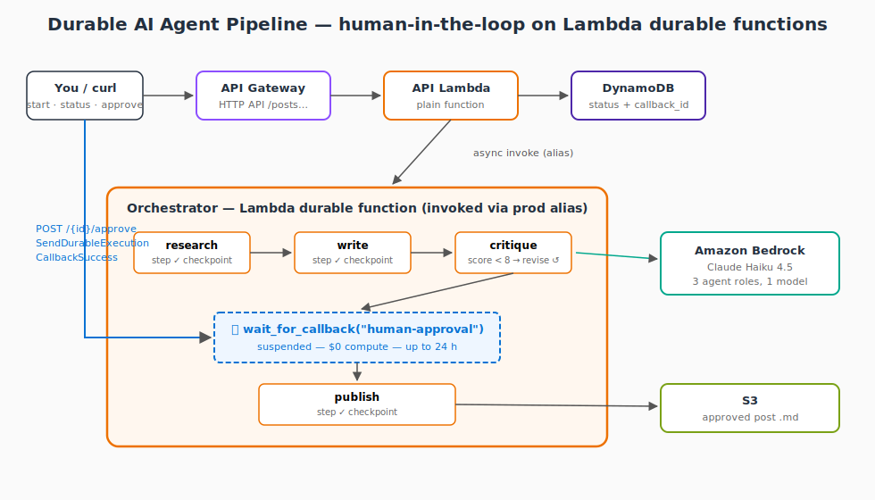

# Lambda functions can pause for free now. I built an AI agent pipeline to test that.

> Published on Medium: [Lambda functions can pause for free now](https://amruteng.medium.com/lambda-functions-can-pause-for-free-now-i-built-an-ai-agent-pipeline-to-test-that-66c2623fb7a7)

TL;DR: Lambda "durable functions" can suspend mid-execution without billing. I built a three-agent content pipeline that pauses for human approval and resumes exactly where it left off, with no Step Functions involved.



Every serverless AI workflow I've built has the same problem. At some point a human needs to review something, and now you have to keep state alive while you wait. Step Functions can do it, but you're paying for the state machine, wiring up a callback pattern, and hoping your payload fits under the size limit. I've also done the Lambda + SQS + polling worker version. It works. It's ugly.

At re:Invent 2025 AWS shipped Lambda durable functions. A durable function can stop in the middle of its code, wait (for ten seconds or ten months), and continue from that exact line later. You don't pay for the waiting time at all. AWS's launch material pointed at multi-agent AI workflows and human approvals as the main use case, so I built one to see if it holds up.

## What I built

A content pipeline with three agents:

1. A researcher that turns a topic into an outline
2. A writer that drafts a post from the outline
3. An editor that scores the draft 1 to 10. If the score is too low, the draft goes back to the writer with feedback and they loop.

When the editor is satisfied, the function suspends and waits for a human to approve or reject the draft. Nothing runs and nothing is billed during the wait. When someone hits the approve endpoint, Lambda resumes the function mid-execution and it publishes the draft to S3.

All three agents are the same model (Claude Haiku 4.5 on Bedrock) with different system prompts. The model isn't the interesting part here. The orchestration is.

## Steps and waits

The durable execution SDK hands your function a DurableContext instead of the normal Lambda context. Two methods do the work:

- `context.step(...)` runs some logic and checkpoints the result. If the function gets interrupted later, completed steps don't re-run. Lambda replays their stored results.
- `context.wait_for_callback(...)` gives you a callback ID, suspends the function, and resumes it when something outside calls back with that ID.

Here's the orchestrator, trimmed down. The snippet omits imports and helper functions like `json`, `call_agent`, `set_status`, `publish_to_s3`, and `execution_id` — it shows the orchestration flow, not the full implementation (that's in [src/orchestrator/lambda_function.py](src/orchestrator/lambda_function.py)):

```python
from aws_durable_execution_sdk_python import DurableContext, durable_execution
from aws_durable_execution_sdk_python.config import Duration, WaitForCallbackConfig

@durable_execution
def lambda_handler(event, context: DurableContext):
    topic = event["topic"]

    outline = context.step(lambda _: call_agent(RESEARCH_PROMPT, topic), name="research")
    draft = context.step(lambda _: call_agent(WRITE_PROMPT, f"{topic}\n{outline}"), name="write-0")

    for revision in range(MAX_REVISIONS):
        critique = json.loads(
            context.step(lambda _: call_agent(EDIT_PROMPT, draft), name=f"critique-{revision}")
        )
        if critique["score"] >= APPROVAL_SCORE_THRESHOLD:
            break
        draft = context.step(
            lambda _: call_agent(REVISE_PROMPT, f"{draft}\n{critique['feedback']}"),
            name=f"write-{revision + 1}",
        )

    def request_approval(callback_id, _ctx):
        # store callback_id + draft in DynamoDB so an API route can find it later
        set_status(execution_id, callback_id=callback_id, draft=draft, status="AWAITING_APPROVAL")

    # The callback result arrives as a raw string, decode it yourself
    approval_raw = context.wait_for_callback(
        request_approval,
        name="human-approval",
        config=WaitForCallbackConfig(timeout=Duration.from_seconds(86400)),
    )
    approval = json.loads(approval_raw) if approval_raw else None

    if not approval or not approval.get("approved"):
        return {"status": "REJECTED"}

    final_url = context.step(lambda _: publish_to_s3(draft), name="publish")
    return {"status": "PUBLISHED", "url": final_url}
```

Notice the revision loop is a normal for loop. No state machine JSON, no Choice states. The editor's decision is a Python if statement, and branching on it is safe because the score came out of a checkpointed step. On replay the stored value is reused instead of calling Bedrock again.

The zero-cost wait is real. I left a run sitting at AWAITING_APPROVAL overnight and the bill for those hours was zero. No polling worker burning invocations, no state machine charging per transition.

## Things that bit me

A few problems I hit that you'll probably hit too.

**The callback IAM permission.** My first approval attempt failed with AccessDeniedException even though I had granted lambda:SendDurableExecutionCallbackSuccess on the function's ARN. Turns out the callback resource is a sub-resource of the versioned function ARN, something like `function:my-fn:2/durable-execution/<execution-id>/<callback-id>`, so a policy on the bare function ARN never matches. You need a trailing wildcard: `"${function_arn}:*"`. This one cost me an hour.

**The docs and the installed SDK disagree.** The doc examples show a one-argument submitter function and `timeout=86400`. The SDK version pip actually installs wants a two-argument submitter and a WaitForCallbackConfig with a Duration object. The feature is a few months old and AWS tells you to pin the SDK version, and they're right. When something this new misbehaves, read the installed source, not the docs.

**LLMs wrap JSON in markdown fences.** My first live run died at the critique step because the editor returned its JSON inside a fenced code block even though the prompt said not to. Five lines of fence stripping before json.loads fixed it. One nice side effect of the versioning model: in-flight executions stay pinned to the code version that started them, so deploying the fix didn't disturb anything already running.

## Getting the human in

The approval side is a small HTTP API in front of a regular, non-durable Lambda:

- POST /posts starts a run and returns an execution_id
- GET /posts/{id} shows the status and the current draft
- POST /posts/{id}/approve approves or rejects

The approve route is the glue. It looks up the callback_id that the orchestrator stashed in DynamoDB before suspending, then tells Lambda the callback succeeded:

```python
lambda_client.send_durable_execution_callback_success(
    CallbackId=item["callback_id"],
    Result=json.dumps({"approved": approved}),
)
```

That one call wakes the orchestrator, it replays its checkpoint log, and execution continues into the publish step.

## Running it end to end

```bash
curl -X POST "$API/posts" -d '{"topic": "why idle compute shouldn'\''t cost money"}'
# {"execution_id": "a1b2...", "status": "STARTED"}

curl "$API/posts/a1b2..."
# {"status": "AWAITING_APPROVAL", "draft": "# Why Idle Compute...\n\n..."}

curl -X POST "$API/posts/a1b2.../approve" -d '{"approved": true}'

curl "$API/posts/a1b2..."
# {"status": "PUBLISHED", "final_url": "s3://.../a1b2....md"}
```

The Durable executions tab in the Lambda console shows every operation with timestamps. You can see each step, the WaitForCallback where it suspended, and the resume after the approval. The durable configuration on the function is two values: how long the whole execution is allowed to live, and how long Lambda keeps the checkpoint history after it finishes. That's separate from the normal Lambda timeout, which still applies to each individual invocation.

## What it cost

Building all of this, including the failed runs, several end-to-end tests, an overnight suspension, and a test suite that deploys and tears down a full copy of the stack, came to $0.21. Almost all of it was Bedrock inference. Each run makes 5 to 7 Haiku calls. The waiting, which is where these workflows spend most of their wall-clock time, costs nothing.

## Where this pattern applies

Replace "blog post" with anything that needs sign-off before something irreversible happens: a refund, a deploy, a customer email, a contract change. The shape is identical. Having built it, I think the pitch holds. The alternatives do the same job with more moving parts.

## Try it yourself

The full Terraform + Lambda code is on GitHub: [amrutp24/durable-ai-agent-pipeline](https://github.com/amrutp24/durable-ai-agent-pipeline). It deploys with `terraform apply` and costs a few cents per run since the wait is free. Instructions and a troubleshooting table are in the README.

I also extracted the infrastructure into a reusable Terraform module, published on the registry as [amrutp24/durable-agent-pipeline/aws](https://registry.terraform.io/modules/amrutp24/durable-agent-pipeline/aws). Since durable functions are new, there weren't existing module conventions to follow, so that repo includes a [DESIGN.md](https://github.com/amrutp24/terraform-aws-durable-agent-pipeline/blob/main/DESIGN.md) with the rules I ended up with (qualified ARN invocation, the callback grant above, SDK pinning, the two separate timeouts), a [security posture doc](https://github.com/amrutp24/terraform-aws-durable-agent-pipeline/blob/main/SECURITY_POSTURE.md) listing every scanner exception with its reason, and a test that deploys the module and drives a real execution through suspend, callback, and resume before tearing it all down.

If you want to get hands-on with agents on AWS, this is a good place to start. The judgment part of an agent, the should-I-retry and should-I-wait decisions, ends up as ordinary Python instead of an orchestration DSL.
